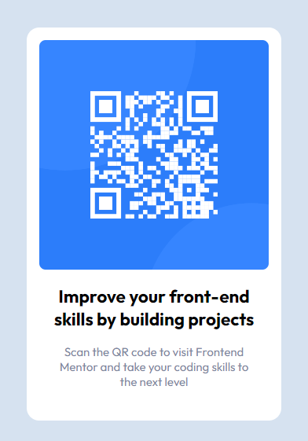

# Frontend Mentor - QR code component solution

This is a solution to the [QR code component challenge on Frontend Mentor](https://www.frontendmentor.io/challenges/qr-code-component-iux_sIO_H). Frontend Mentor challenges help you improve your coding skills by building realistic projects. 

## Table of contents

- [Overview](#overview)
  - [Screenshot](#screenshot)
  - [Links](#links)
- [My process](#my-process)
  - [Built with](#built-with)
  - [What I learned](#what-i-learned)
- [Author](#author)

**Note: Delete this note and update the table of contents based on what sections you keep.**

## Overview

### Screenshot

### Links

- Solution URL: [Add solution URL here](https://www.frontendmentor.io/solutions/qr-code-component--Vshy_jUhS)
- Live Site URL: [Add live site URL here](https://qrcodecomponent.polzak.repl.co/)

## My process

### Built with

- Semantic HTML5 markup
- SCSS
- Flexbox

### What I learned

 - Every site should always have a main element not only for semantic purposes but also to help assistive technology find the main content of your content. For this challenge, it will serves as the component’s container. 
 - [MDN Main Element](https://developer.mozilla.org/en-US/docs/Web/HTML/Element/main)
 - Avoid skipping heading levels. Always start with the h1 (which can only be used once) and you will go down the hierarchy level depending on the heading’s importance.
 - The alt tag description for the “QR image” needs to be improved upon. It needs to tell screen reader users what it is and where it will take them to when they scan it.
 - change the height to min-height in your body element to improve your component's responsiveness. 
 - Change the width to max-width in your component’s container to make it responsive.

## Author

- Website - [Seungwan Kim](https://www.polzak.net)
- Frontend Mentor - [@polzak](https://www.frontendmentor.io/profile/polzak)
