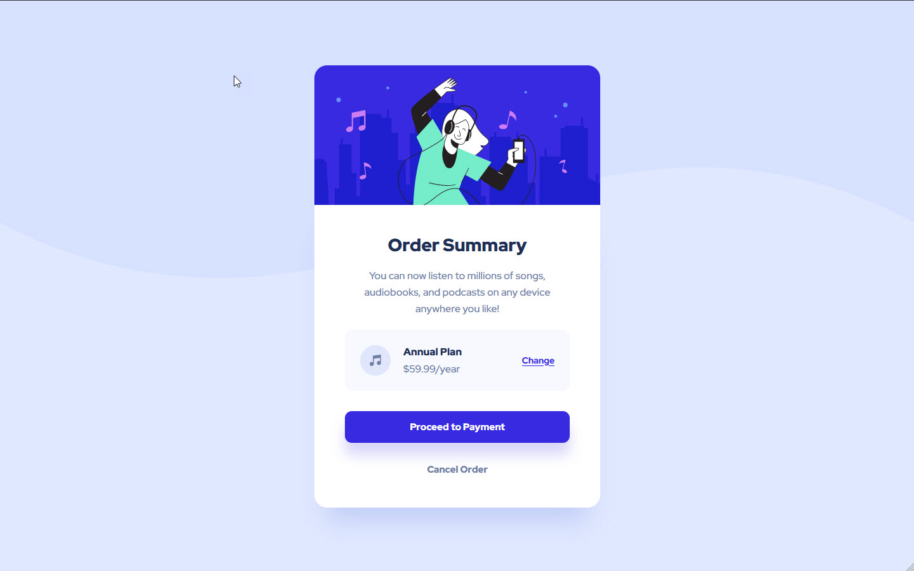

# Frontend Mentor - Order summary card solution

This is a solution to the [Order summary card challenge on Frontend Mentor](https://www.frontendmentor.io/challenges/order-summary-component-QlPmajDUj). Frontend Mentor challenges help you improve your coding skills by building realistic projects. 

## Table of contents

- [Overview](#overview)
  - [The challenge](#the-challenge)
  - [Screenshot](#screenshot)
  - [Links](#links)
- [My process](#my-process)
  - [Built with](#built-with)
  - [What I learned](#what-i-learned)
  - [Useful resources](#useful-resources)
- [Author](#author)

## Overview

### The challenge

Users should be able to:

- See hover states for interactive elements

### Screenshot

### Links

- Solution URL: [My solution](https://www.frontendmentor.io/solutions/order-summary-with-hover-effects-responsive-Wg9qZzIDoz)
- Live Site URL: [My creation](http://polzak.github.io/portfolio/fem/05-order-summary/index.html)

## My process

### Built with

- Normal HTML and CSS
- Mobile-first workflow

### What I learned

- Some elements such as a button will have their own default border width or paddings; you need to reset them to be more precise with the original design.  
- The section HTML element represents a generic standalone section of a document, which doesn't have a more specific semantic element to represent it. Sections should always have a heading, with very few exceptions. (MDN)

### Useful resources

- [background-position](https://developer.mozilla.org/en-US/docs/Web/CSS/background-position)
- [HTML section element](https://web.dev/learn/html/headings-and-sections/)

## Author

- Website - [Seungwan Kim's Portfolio](https://polzak.github.io)
- Frontend Mentor - [@polzak](https://www.frontendmentor.io/profile/polzak)
