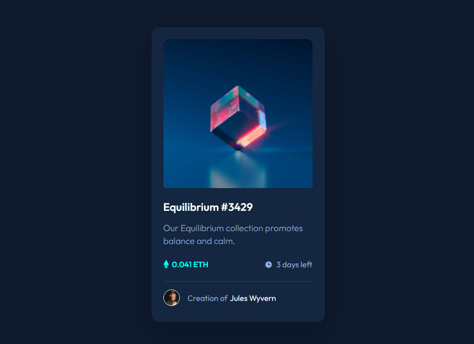

# Frontend Mentor - NFT preview card component solution

This is a solution to the [NFT preview card component challenge on Frontend Mentor](https://www.frontendmentor.io/challenges/nft-preview-card-component-SbdUL_w0U). Frontend Mentor challenges help you improve your coding skills by building realistic projects. 

## Table of contents

- [Overview](#overview)
  - [The challenge](#the-challenge)
  - [Screenshot](#screenshot)
  - [Links](#links)
- [My process](#my-process)
  - [Built with](#built-with)
  - [What I learned](#what-i-learned)
  - [Useful resources](#useful-resources)
- [Author](#author)

## Overview

### The challenge

Users should be able to:

- View the optimal layout depending on their device's screen size
- See hover states for interactive elements

### Screenshot

### Links

- Solution URL: 
- Live Site URL: [My design](https://polzak.github.io/portfolio/fem/06-nft-preview-card/index.html)

## My process

### Built with

- Mobile-first workflow
- [Tailwind CSS](https://tailwindcss.com/) - CSS framework

### What I learned

- how to blend two images using background-image property and image element
- use pseudo elements to put decorative images like icons
- how to align pseudo elements using flexbox

### Useful resources

- [css mix-blend-mode](https://developer.mozilla.org/docs/Web/CSS/mix-blend-mode)

## Author

- Website - [Seungwan Kim's Portfolio](https://polzak.github.io)
- Frontend Mentor - [@polzak](https://www.frontendmentor.io/profile/polzak)
